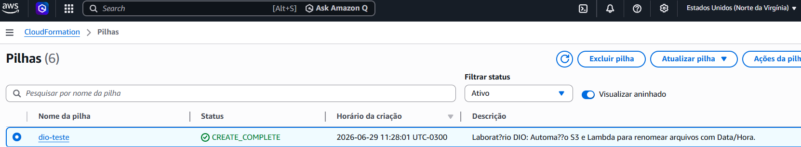
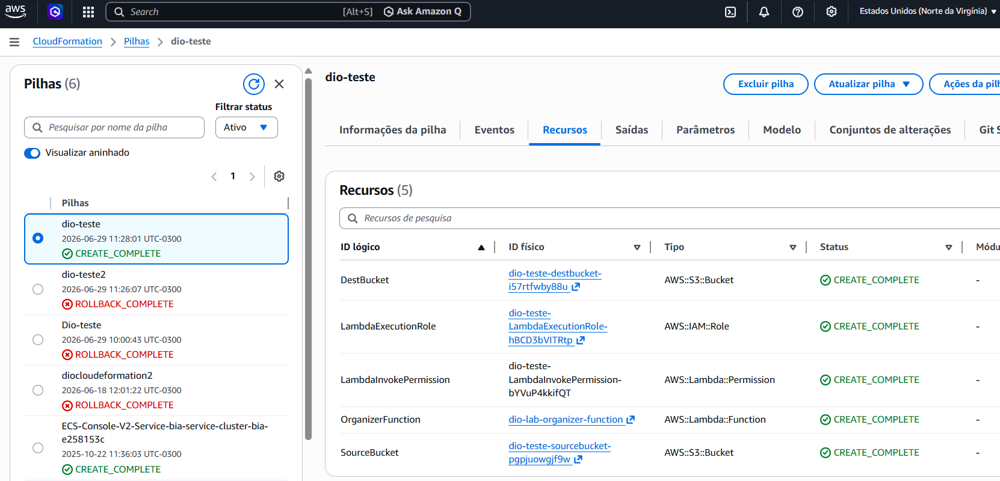
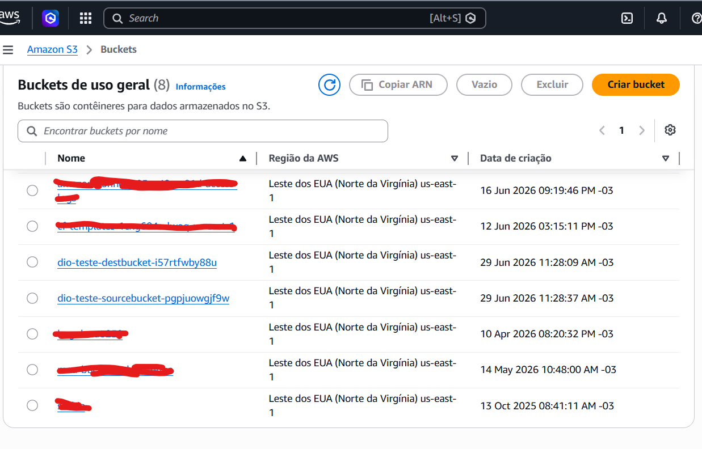
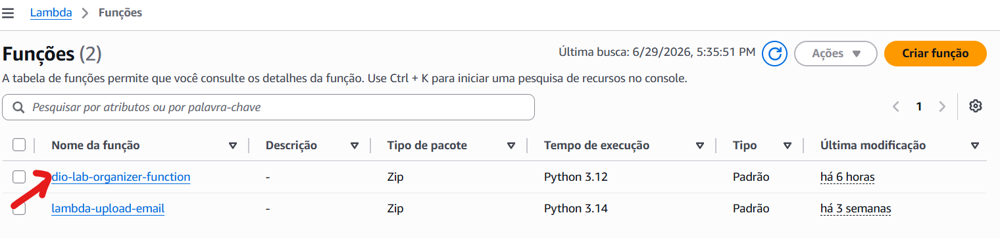
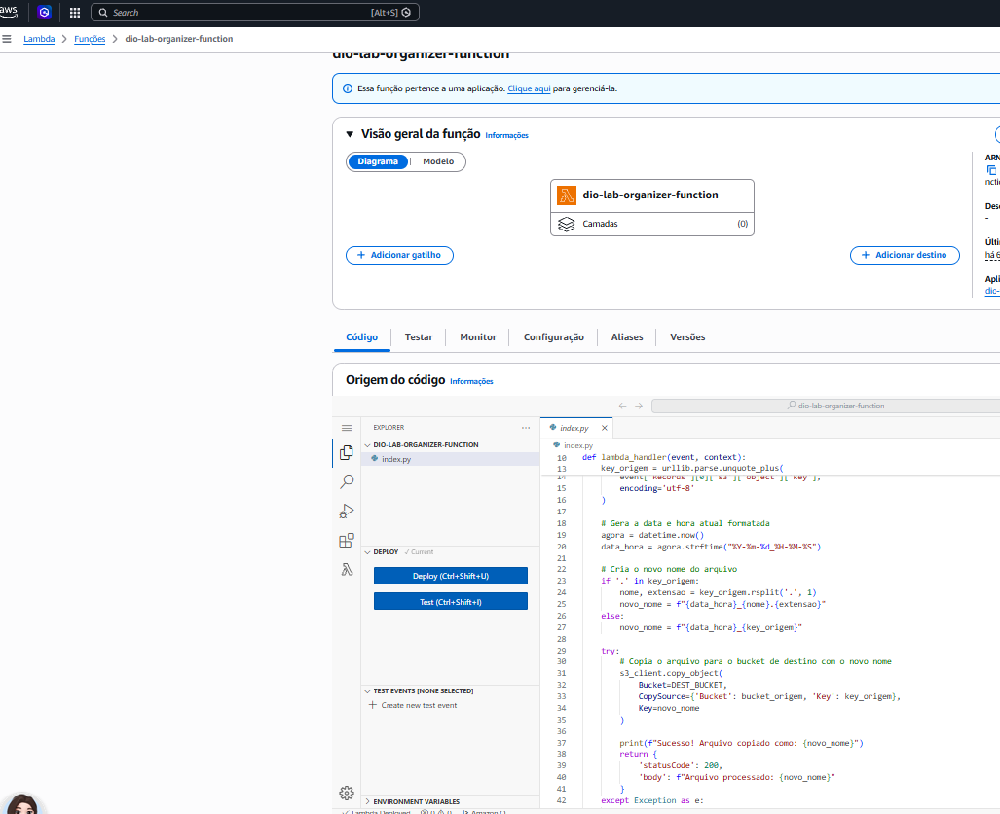

# 🚀 Desafio DIO — Step Functions + S3 + Lambda

**Automação serverless para renomear arquivos no S3 com Data/Hora usando AWS Lambda e CloudFormation.**

---

## 📋 Descrição

Sempre que um arquivo é enviado para o **bucket de origem**, uma função **Lambda** é disparada automaticamente, copia o arquivo para o **bucket de destino** e adiciona um prefixo com **data e hora** (`YYYY-MM-DD_HH-MM-SS_`) ao nome original.

Toda a infraestrutura é provisionada como código via **CloudFormation**.

---

## 🏗️ Arquitetura

```
┌─────────────────┐     s3:ObjectCreated     ┌──────────────────┐     copy_object      ┌─────────────────┐
│  Bucket Origem  │ ────────────────────────→ │  Lambda Function │ ──────────────────→ │  Bucket Destino  │
│  (SourceBucket) │                           │  (Organizer)     │                     │  (DestBucket)    │
└─────────────────┘                           │  python3.12      │                     └─────────────────┘
                                              └──────────────────┘
```

## 🔧 Recursos CloudFormation (template.yaml)

| Recurso | Tipo | Descrição |
|---------|------|-----------|
| `SourceBucket` | `AWS::S3::Bucket` | Bucket de origem com versionamento e gatilho de notificação |
| `DestBucket` | `AWS::S3::Bucket` | Bucket de destino para arquivos renomeados |
| `LambdaExecutionRole` | `AWS::IAM::Role` | Permissões S3 (Get/Put/List) + CloudWatch Logs |
| `OrganizerFunction` | `AWS::Lambda::Function` | Função Python que copia e renomeia arquivos |
| `LambdaInvokePermission` | `AWS::Lambda::Permission` | Permite que S3 invoque a Lambda |

---

## 🚀 Deploy

### Pré-requisitos

- AWS CLI instalado e configurado
- Permissão para criar recursos S3, Lambda e IAM

### Comando

```bash
aws cloudformation deploy \
  --template-file template.yaml \
  --stack-name dio-lab-s3-lambda \
  --capabilities CAPABILITY_IAM
```

### Outputs do Stack

| Output | Descrição |
|--------|-----------|
| `SourceBucketName` | Nome do bucket de origem |
| `DestBucketName` | Nome do bucket de destino |
| `LambdaFunctionName` | Nome da função Lambda (`dio-lab-organizer-function`) |

---

## 🐍 Lógica da Lambda (lambda.py)

```python
# 1. Extrai o nome do arquivo do evento S3
# 2. Gera data/hora atual formatada (YYYY-MM-DD_HH-MM-SS)
# 3. Cria novo nome: DATAHORA_nome_original.ext
# 4. Copia do bucket de origem para o bucket de destino
# 5. Logs no CloudWatch
```

Exemplo: `foto.png` → `2026-06-29_17-30-15_foto.png`

---

## 📸 Screenshots

### CloudFormation Stack


### CloudFormation Resources


### Buckets S3


### Lambda Function


### Lambda Execution


---

## 📂 Estrutura do Projeto

```
Dio_step_functions_S3_Chalenger/
├── README.md
├── template.yaml          ← CloudFormation (infra como código)
├── lambda.py              ← Código standalone da Lambda (referência)
└── imagens/
    ├── Screenshot_cloudeformation.png
    ├── Screensho_cloudeformation2.png
    ├── Screenshot_buckets.png
    ├── Screenshot_lambda.png
    └── Screenshot_lambda02.png
```

---

## ⚠️ Observações

- Os nomes dos buckets são gerados automaticamente pelo CloudFormation (garantindo unicidade global)
- A Lambda usa **variáveis de ambiente** (`DEST_BUCKET_NAME`) para o bucket de destino (boa prática)
- Runtime: **python3.12**
- Versionamento habilitado no bucket de origem